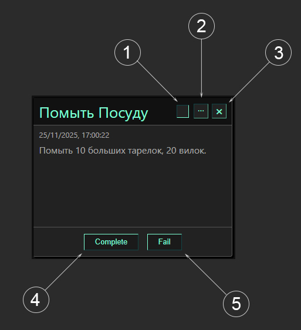

# Task Planner

## О проекте
**Task Planner** -  это проект про работу с DOM, продвинутый Error handling, и про пользовательские удобства такие как: Multi Selection, Drag and Drop, Filter, Sort.  
В **Task Planner** мы  даём возможность пользователю создавать *Задачи*, которые имеют уникальный ID, время создания, Название и описание которое заполняет пользователь.  
Задача имеет 3 основных статуса: Active(действующее задание), Failed(Проваленное задание), Completed(Выполненное задание).  
Также пользователь может редактировать название Задания, его описание, а также и вовсе удалять задание.  
Задачи хранятся Локально в браузере, с помощью JSON внутри Localstorage.
## Основные критерии
1. **HTML** - Соответствует W3C Валидации.  
2. **CSS** - Соответствует W3C Валидации.  
3. **JS** - Соответсвует правилам ESlint.  
4. **Проект** работает во всех современных браузерах.  
5. **Проект** написан без использования каких либо Фреймворков, Библиотек, Импортов.  
6. **Проект** не выдаёт никаких Ошибок в Консоль.  

## Проверка
Для проверки Eslint следует написать в папке с проектом:
``` bash
npx eslint .
```
В случае если всё правильно, то оно ничего не выведет!  

Для проверки  W3C HTML Validaton используем сайт:
``` bash
https://validator.w3.org/
```
Для проверки  W3C CSS Validaton используем сайт:
``` bash
https://jigsaw.w3.org/css-validator/
```

## Как пользоваться сайтом
1. **Чекбокс** - Индикатор выделенна ли задача.
2. **Троеточие** - Редактирование задачи.
3. **Крестик** - Полное удаление задачи из списка.
4. **Complete** - Задача получает статус Выполнено
5. **Fail** - Задача получает статус Невыполнено  



## Автор
[бекулямба](https://platform.alem.school/git/bekulymba)